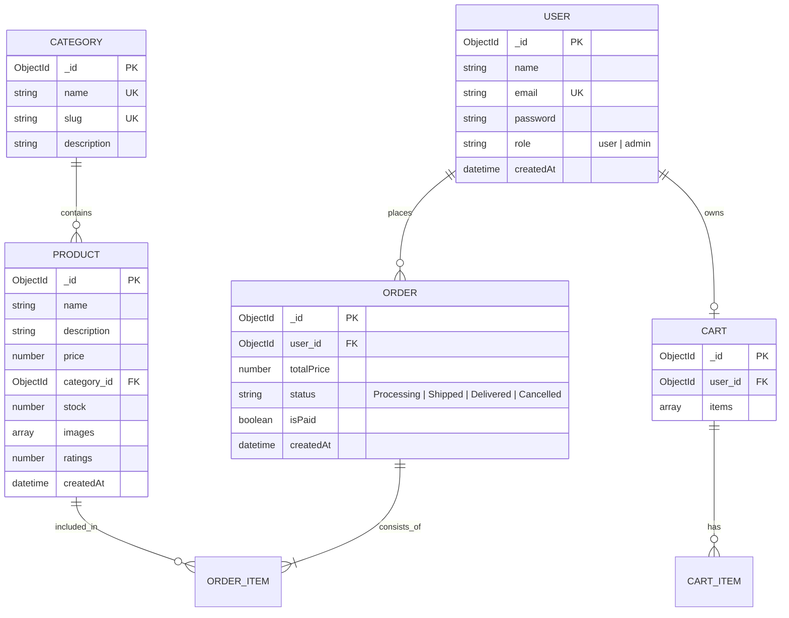

# Week 5: E-Commerce API - Database Schema & Architecture

This document outlines the database design and API structure for the E-Commerce backend project.

## Database Schema (ER Diagram)

## API Endpoints

### Authentication
- `POST /api/auth/register` - Register a new user
- `POST /api/auth/login` - Login user & get token
- `GET /api/auth/me` - Get current user profile (Protected)

### Products
- `GET /api/products` - Get all products (Search, Filter, Pagination)
- `GET /api/products/:id` - Get product details
- `POST /api/products` - Create product (Admin Only)
- `PUT /api/products/:id` - Update product (Admin Only)
- `DELETE /api/products/:id` - Delete product (Admin Only)

### Categories
- `GET /api/categories` - Get all categories
- `POST /api/categories` - Create category (Admin Only)
- `DELETE /api/categories/:id` - Delete category (Admin Only)

## Key Features Implemented
1. **Advanced Filtering**: Filter products by category and price range.
2. **Full-Text Search**: Search products by name and description using MongoDB text indexing.
3. **RBAC (Role Based Access Control)**: Middleware to restrict sensitive operations to administrators.
4. **JWT Authentication**: Secure stateless authentication for users.
5. **Data Integrity**: Using Mongoose schemas with validation and unique constraints.
